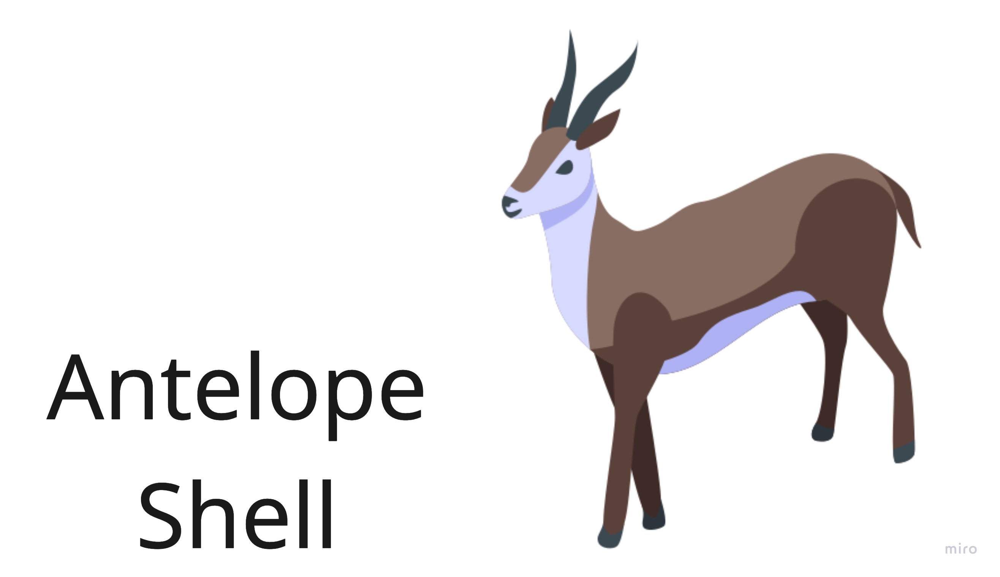

# Antelope Shell (ash)

Terminal assistant that translates natural language into efficient shell commands using a local model.
Works on top of zsh, simply hit CTRL + G to enable ash mode

## Requirements
- Python 3.8+
- Go 1.16+
- macOS/Linux
- ~2GB free disk space (for the model)

## Installation

### Homebrew Installation (Recommended)

```bash
# Add the tap (if not already added)
brew tap cjan/ash

# Install ash
brew install ash

# Complete the installation
ash-install

# The model will be automatically downloaded on first run
```

### Building from Source

```bash
# Clone and setup
git clone https://github.com/golark/ash.git
cd ash

# Build the application
make build

# Install
make install
```

## Usage

### Basic Usage

1. Enable Ash mode by pressing `Ctrl+G` in your terminal
2. Type natural language queries like "find all Python files" or "show disk usage"
3. Ash will translate them into shell commands

### Custom Model Configuration

Ash uses the Qwen2.5-Coder-3B-Quantized model by default, but you can use any compatible GGUF model:

**Environment Variable:**
```bash
export ASH_MODEL_PATH="/path/to/your/model.gguf"
```

**Command Line:**
```bash
ash-server --model-path "/path/to/your/model.gguf"
```

**Supported Model Formats:**
- GGUF format models (recommended)
- Models compatible with llama-cpp-python

## How to Contribute

We welcome contributions!

1. Fork this repository
2. Create a new branch for your feature or fix
3. Make your changes and commit them
4. Open a pull request

For major changes, please open an issue first to discuss what you would like to change.

## License

This project is licensed under the Apache 2.0 License - see the [LICENSE](LICENSE) file for details.

